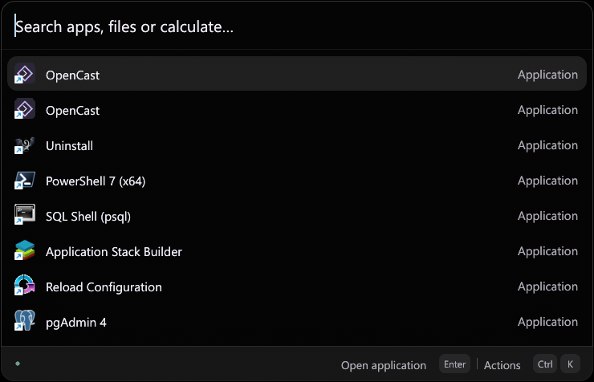
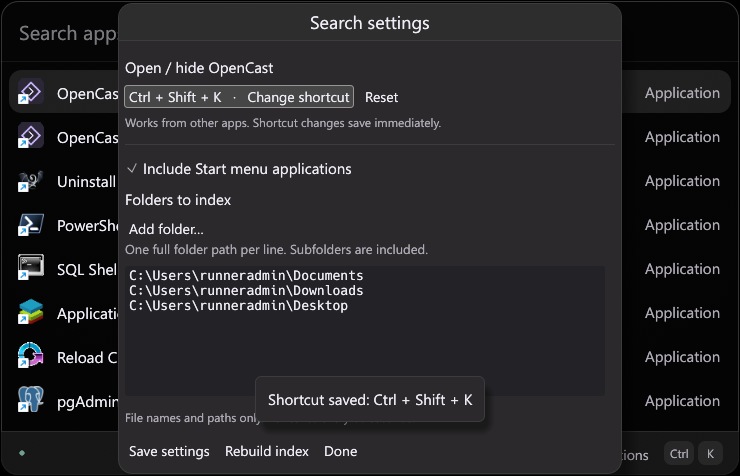

# OpenCast

An open-source, resident Windows launcher for opening apps, finding files and doing quick calculations. Written entirely in Rust, with a native GPU-rendered interface. Inspired by Raycast; an independent project with its own code and assets.





The compact palette uses a single search row, native Windows shell icons, and a searchable actions panel. Windows uses Segoe UI and native acrylic blur where supported. The screenshots above were captured from the installed Windows build during automated interaction tests.

## Install on Windows

1. Open [Releases](https://github.com/AverWasTaken/opencast/releases).
2. Download `OpenCast-0.2.0-windows-x64-setup.exe` and run it.
3. Launch **OpenCast** from Start or the desktop shortcut. Press **Alt+Space** from any app to show or hide OpenCast.

The installer targets Windows 10/11 x64, installs for your user without administrator rights, and includes an uninstaller in Windows Settings → Apps. No Rust, terminal, browser runtime, or account is needed. A portable executable is also included in releases. Initial builds are unsigned, so Windows may show a publisher/SmartScreen warning.

Installed Start menu apps, Documents, Downloads and Desktop are indexed on first launch when available. Use **Settings → Add folder** to include other locations. Uninstalling preserves your local settings and index; delete `%LOCALAPPDATA%\OpenCast\OpenCast\data` if you also want to remove them.

## What works

- Filename and path search, with exact, prefix, substring, multiple-word and fuzzy filename matching.
- Background indexing; cached startup; automatic refresh every 60 seconds and a manual rebuild action.
- Recent files when the search field is empty; open files in their default applications, open containing folders, and copy paths.
- Offline arithmetic with parentheses, powers, constants and functions: `(24 + 8) / 2`, `2^8`, `sqrt(144)`.
- Unit conversions: `10 km to mi`, `72 f to c`, `5 kg to lb`, `90 min to h`, `1 GiB to MiB`. Expressions also work: `(2 + 3) kg to g`.
- Native application, shortcut and file-association icons, loaded asynchronously from the Windows shell.
- Resident global hotkey, single-instance activation and a tray menu.
- Custom shortcut recorder with conflict detection and persistent settings.
- Optional startup at sign-in, Windows folder picker, and per-user installation.

| Shortcut | Action |
| --- | --- |
| Alt+Space (customizable) | Show / hide OpenCast from any app |
| ↑ / ↓ | Select a result |
| Enter | Open selected file or copy calculation |
| Ctrl+Shift+C | Copy selected path or calculation |
| Ctrl+K | Actions |
| Ctrl+, | Search settings |
| Escape | Dismiss a panel, or hide the launcher |

To change the global hotkey, open **Ctrl+, → Change shortcut**, then press your preferred combination. Changes save immediately. Press Escape to cancel recording or Reset to restore Alt+Space. Use Ctrl, Alt or Win with a key, or a function key. If another app owns the combination, OpenCast keeps the previous shortcut. The tray menu is always available to reopen Settings.

Escape and clicking away dismiss the launcher while indexing remains in the background. Opening the app again reuses the existing process. Use **tray menu → Quit OpenCast** to exit. The installer offers **Start OpenCast when I sign in**; deselect it if you prefer to start the app manually.

Click a file to select it; double-click to open. Choose **Actions → Search files only** to search for a filename that looks like a calculation. Calculator errors are shown inline. On macOS source builds, Command replaces Ctrl.

## Supported units

| Dimension | Units |
| --- | --- |
| Length | mm, cm, m, km, in, ft, yd, mi |
| Mass | mg, g, kg, oz, lb |
| Time | ms, s, min, h, d |
| Volume | ml, l, gal (US liquid gallon) |
| Temperature | c / °c, f / °f, k |
| Data | B, KB, MB, GB, TB (decimal); KiB, MiB, GiB (binary) |
| Angle | deg, rad |

Use `to` or `in` between units. Units are case-insensitive; `b` means bytes, not bits. Arithmetic uses floating-point numbers and displays up to eight decimal places. Currency, compound units, natural-language dates and percentages are outside this MVP.

## Local by design

The search index reads directory entries and file metadata, without indexing document contents. Windows shell icon resolution also reads application/shortcut icon resources and registered file associations. There is no telemetry or network service. The local index contains file names and paths; it is not encrypted. Hidden entries, symlinks, AppData, `.git`, `node_modules`, and `target` are excluded. Gitignored files are included. Unreadable entries are skipped and counted in the index status tooltip.

Search uses an in-memory snapshot with a bounded top-40 ranking heap. Scanning and searching run on separate threads; an existing snapshot remains searchable during refresh. Updates become visible when the scan completes. The JSON cache is disposable and regenerated if missing or invalid.

## Development

Install the current stable [Rust toolchain](https://rustup.rs/). Windows development also needs Visual Studio Build Tools with **Desktop development with C++**.

```sh
cargo run --locked
cargo test --locked
cargo clippy --locked --all-targets -- -D warnings
cargo fmt --all -- --check
cargo build --locked --release
```

Linux source builds need a desktop session, OpenGL and X11/Wayland runtime libraries (including `libxkbcommon-x11-0` for X11). Windows is the supported distribution target; macOS and Linux installers are not provided.

Build the Windows installer using [Inno Setup 6](https://jrsoftware.org/isinfo.php):

```powershell
cargo build --locked --release
& "${env:ProgramFiles(x86)}\Inno Setup 6\ISCC.exe" packaging/windows/opencast.iss
```

The `Build and test` workflow checks Linux and Windows and uploads a Windows installer artifact. Pushing a version tag matching `Cargo.toml` (e.g. `v0.2.0`) runs the release workflow and publishes a prerelease with installer, portable executable and SHA-256 checksums.

## MVP boundaries

This is a file launcher and calculator, not an extension platform yet. It does not index file contents, watch changes instantly, or update itself. Application search covers Start menu shortcuts; apps without a Start menu entry may require adding their folder. Initial indexing time and memory use depend on the selected folders. Very large trees and network drives can take longer to refresh.

## Contributing

Small, focused pull requests are welcome. Include tests for changes to search ranking, indexing or calculator semantics, and a screenshot for interface changes. Run the checks above before opening a PR. See [the architecture notes](docs/architecture.md) for the main modules.

MIT licensed. See [LICENSE](LICENSE).
